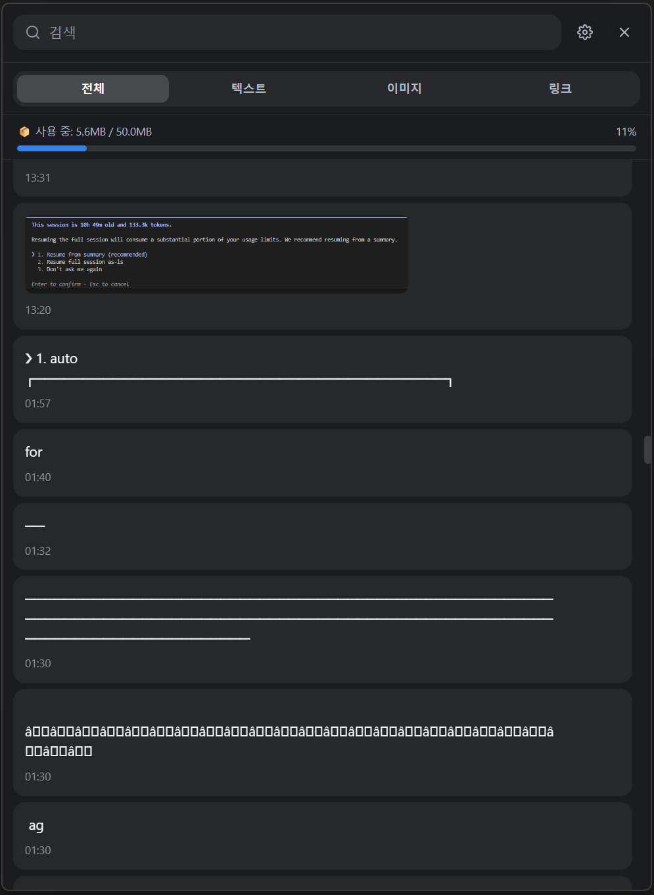
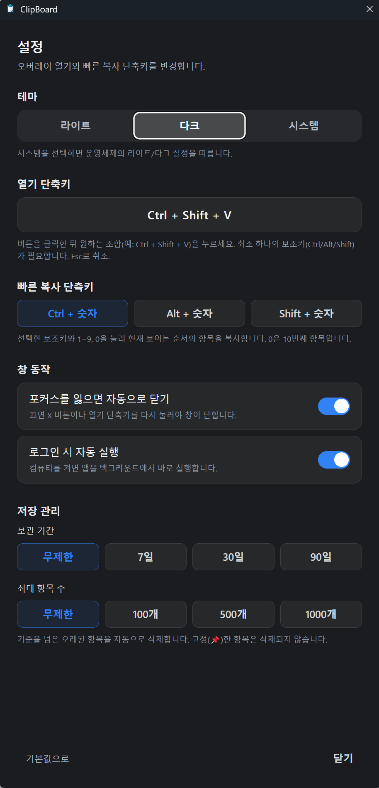
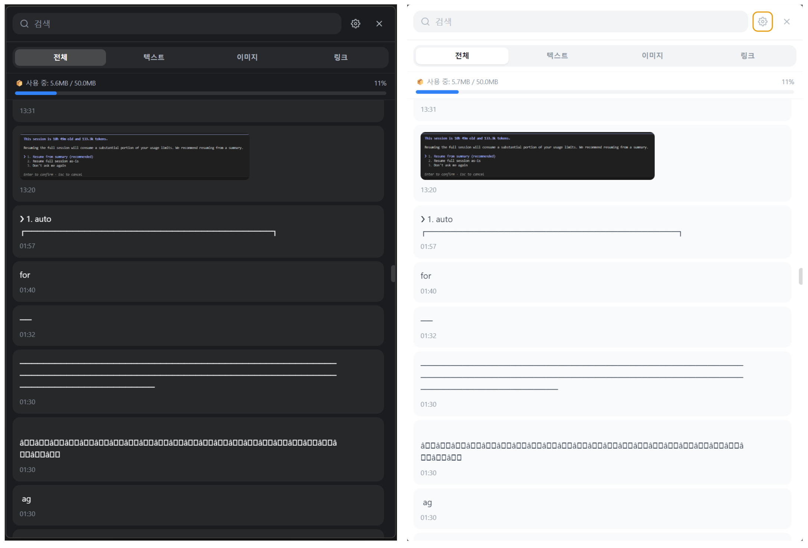
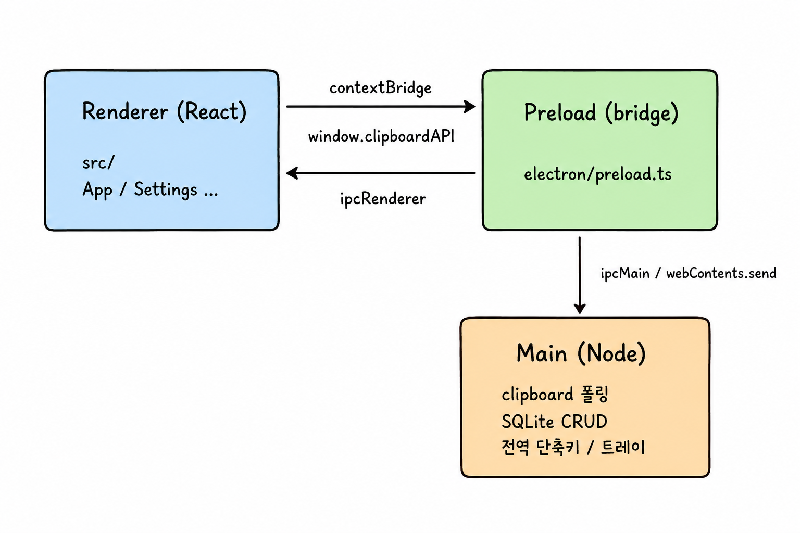

# 📋 ClipBoard — 클립보드 히스토리 매니저

복사한 텍스트·링크·이미지를 자동으로 기록하고, 전역 단축키로 언제든 꺼내 쓰는
데스크탑 클립보드 매니저입니다. **macOS / Windows** 모두 지원합니다.

<p>
  
  
  
  
  
</p>

<!-- 스크린샷: docs/screenshots/ 에 이미지를 넣으면 표시됩니다 (docs/screenshots/README.md 참고) -->







## ✨ 기능

- **자동 캡처** — 500ms 폴링으로 클립보드 변경을 감지해 저장 (직전 항목과 중복이면 건너뜀)
- **타입 분류** — `text` / `link`(http·https) / `image`(PNG) 자동 구분 후 탭 필터 제공
- **영구 저장** — `better-sqlite3` 로 로컬 DB(`userData/clipboard.db`)에 보관, 재시작해도 유지
- **오버레이 창** — `Ctrl/Cmd + Shift + V` 로 토글하는 frameless 창, 포커스를 잃으면 자동 숨김
- **고정(즐겨찾기)** — 중요한 항목을 상단에 고정, 자동 정리 대상에서 제외
- **자동 정리** — 보관 기간(일) / 최대 개수 초과 시 오래된 항목부터 삭제 (기본값 무제한)
- **빠른 복사** — 목록이 열린 상태에서 `수정자 + 숫자키(1~9)` 로 해당 항목을 즉시 복사
- **테마** — 라이트 / 다크 / 시스템(OS 추종) 3종, 모든 창에 실시간 반영
- **트레이** — 열기 / 전체 삭제 / 종료, 로그인 시 자동 실행 옵션
- **커스터마이즈** — 전역 단축키 재지정, 창 크기 저장, 포커스 아웃 시 숨김 여부 토글

## 🛠 기술 스택

| 영역          | 사용 기술                                               |
| ------------- | ------------------------------------------------------- |
| 메인 프로세스 | Electron 30, TypeScript, better-sqlite3, electron-store |
| 렌더러        | React 18, TailwindCSS 3, Vite 5                         |
| 빌드          | vite-plugin-electron, electron-builder(NSIS · DMG)      |

## 🏗 아키텍처

세 계층으로 분리되어 있고, 렌더러는 오직 preload 가 노출한 API 로만 메인과 통신합니다.



- **렌더러 → 메인**: `window.clipboardAPI.xxx()` → `ipcRenderer.invoke(채널)` → `ipcMain.handle(채널)`
- **메인 → 렌더러**: `webContents.send(채널)` → preload 의 `onNewItem` / `onCleared` / `onToast` / `onThemeChanged` 구독

```
electron/   main.ts · clipboard.ts · db.ts · settings.ts · tray.ts · preload.ts
src/        App.tsx · main.tsx · components/ · types/ · utils/
```

### 보안 설계

- `contextIsolation: true`, `nodeIntegration: false`
- 네이티브 모듈(`better-sqlite3`)은 **메인 프로세스에서만** 사용
- 렌더러는 `window.clipboardAPI`(preload contextBridge) 를 통해서만 DB/클립보드에 접근

## 🚀 개발

```bash
npm install      # 의존성 설치 + better-sqlite3 네이티브 리빌드
npm run dev      # Vite 개발 서버 + Electron 자동 실행
npm run build    # 타입체크(tsc) + 프로덕션 번들
```

### ⚠️ `ELECTRON_RUN_AS_NODE` 주의

셸 환경에 `ELECTRON_RUN_AS_NODE=1` 이 설정되어 있으면 Electron 이 **일반 Node 로
실행**되어 `require('electron')` 이 API 객체 대신 실행파일 경로 문자열을 반환합니다
(→ `app.whenReady` 가 undefined). 앱 실행 전에 해제하세요.

```powershell
# PowerShell
$env:ELECTRON_RUN_AS_NODE=$null ; npm run dev
```

```bash
# bash
unset ELECTRON_RUN_AS_NODE && npm run dev
```

## 📦 빌드 / 배포

```bash
npm run dist:win   # Windows NSIS 설치 프로그램
npm run dist:mac   # macOS DMG
```

배포 전 `assets/` 에 아이콘을 넣어주세요 (자세한 내용은 `assets/README.md`):

- `icon.ico` (Windows, 트레이 포함)
- `icon.icns` (macOS)
- `iconTemplate.png` (macOS 트레이)

아이콘이 없어도 개발 실행은 가능합니다(투명 플레이스홀더 폴백).

## 📄 라이선스

MIT
